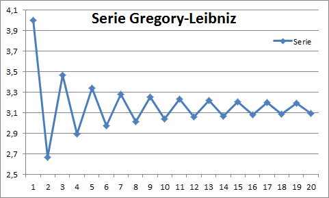
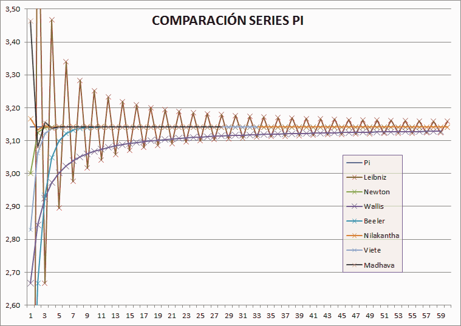

# CALCULO PI

A partir del ejemplo en libro [Classic Computers Science Problems de David Kopec](https://github.com/davecom)

fuente: [calculating_pi.py](https://github.com/davecom/ClassicComputerScienceProblemsInPython/blob/master/Chapter1/calculating_pi.py)

Donde presenta una solución del tipo secuencia para calcular el número Pi, series infinitas de Gregory-Leibniz

`ej: 4/1 - 4/3 + 4/5 - 4/7 + 4/9 - 4/11 + .... - 4/1000000`

dando como resultado tras el **1 millon** de iteraciones: **3.14159**

Se realiza propuesta de mejora al algoritmo de cálculo

dando como resultado a las 29 iteraciones y 18 promedios: **3.1415926535897**

## Pasos a seguir:
- Enfocarse en el objetivo
- Comprender el algoritmo y el cálculo
- Analizar los resultados parciales
- Generar una analogía para mejor comprensión
- Reducir el problema

## Series infinitas de Gregory-Leibniz:
- Las series infinitas de Gregory-Leibniz es una de las tantas formas de obtener el número Pi, sin embargo es considerada ineficiente por la cantidad de Iteraciones requeridas.
- Pero es también una de las más simples de implementar y fáciles de entender.

```
# Calcula Pi utilizando las series infinitas de Gregory-Leibniz #
def pi_leibniz(n_terms: int) -> float:
    pi = 0
    sum_res = 1
    for i in range(1, n_terms, 2):  # serie impar
        pi += (4 / i) * sum_res     # acumula diferencias cada vez mas pequeñas
        sum_res *= -1               # intercala suma y resta
    return pi
```



## Mejoras al Algoritmo:
+ Calcula Pi en una secuencia con promedios escalonados y en cascada.
+ Reduce considerablemente el número de iteraciones y aumenta la precisión rápidamente.
+ Aporte realizado por Antonio Molina el 2023 para el 14 de marzo, 3.14 día de Pi.

## Como:
- Calcula la serie para una cantidad muy reducida de Iteraciones.
- Reserva los N últimos promedios escalonados de la serie.
   - Promedios Escalonados: cuando sube una escalera, mantiene ambos pies en los escalones, en ese momento promedia ambos, luego sube un peldaño, manteniendo un escalón en común con el estado anterior y nuevamente promedia ambos, eso es escalonado.
- Una vez calculados los N promedios pasa al siguiente nivel, realizando un promedio en Cascada, reduciendo nivel por nivel los resultados en uno, hasta que solo quede un número.
   - Promedio en Cascada: teniendo N resultados, estos son promediados escalonados, obteniendo N-1 resultados, e iterando con el siguiente nivel, asi hasta llegar a obtener solo un resultado N=1.


## Que ocurre ?

- Debido a que la iteración suma y resta fracciones del número 4 cada vez más pequeñas, que son divisiones de números impares, esta ira generando por cada ciclo una diferencia hacia arriba con las sumas y hacia abajo con las restas, así hasta aproximarse al número final, el límite de la función, que en este caso el Pi.

- Lo que se plantea es promediar estas diferencias que se generan al tirar hacia arriba y hacia abajo, llegando más rápido al resultado.

- El truco esta en realizar promedios escalonados (de a pares y solapados), aprovechando la diferencia entre un número sumado y uno restado, luego el restado con el siguiente sumado y así sucesivamente, cada par dará una rápida aproximación al número limite, si se promedia un set de *N* números, con sus resultados obtendremos *N-1* números, cada vez perderemos un número y seguir así hasta que solo queda un solo número, este será la aproximación más cercana que podremos tener con muy pocas iteraciones.


## Algoritmo:
- Tras iterar una cantidad pequeña definida por los parámetros *n_iter - n_prom*, ej. *n_iter=16* y *n_prom=9*, comienza a guardar los últimos *n_prom* cálculos de la iteración.

- Los datos guardados serán promediados escalonados, aquí existe una diferencia entre números que sumaron y los que restaron en la secuencia, su promedio tiende a ser el resultado.

- Luego los promedios resultantes que son uno menos que al inicio, vuelven a ser promediados y siguen iterando los promedios hasta que solo queda un número como resultado.

```
def calcula_pi(n_iter: int, n_prom = 1) -> float:
    Pi = 0
    denominator = 1
    operation = 1
    dato = []
    prom = []

    #calcula serie Leibniz
    for i in range(n_iter):
        pi += operation * (numerator / denominator)
        denominator += 2.0
        operation *= -1.0
        #acumula ultimos N resultados para promediar
        if(i>=n_iter-n_prom): dato.append(pi)

    #calcula promedios en cascada
    while(len(dato) > 1):
      prom = []

      #calcula promedio escalonado
      for i, num in enumerate(dato[0:-1]):
          prom.append( (num + dato[i+1]) /2 )
      dato = prom.copy()

    return dato[0]
```


## Resultados:
```
Pi = 3.141592653589793

iter, prom, error,     result
   9,   6   err:5e-5   3.1415 3820036173 
  11,   7   err:-6e-6  3.14159 86833943497       <-  el original requirio 1 millon de iter para alcanzar esto
  13,  10   err:5e-7   3.141592 1043704067 
  16,   9   err:3e-8   3.1415926 186270062 
  17,  11   err:-6e-9  3.14159265 9926378
  20,  11   err:4e-10  3.141592653 10039 
  21,  14   err:6e-11  3.1415926535 244623
  23,  14   err:9e-12  3.14159265358 0177 
  25,  18   err:7e-13  3.141592653589 0586
  27,  18   err:7e-14  3.1415926535897 16
  29,  18   err:9e-15  3.1415926535897 833
  30,  18   err:-6e-15 3.14159265358979 93
  31,  20   err:-4e-16 3.141592653589793 6       <- alcanza 15 dígitos de precisión la máxima capacidad de float
```

- Un detalle importante es que para lograr un buen promedio, las mejores alternativas fue dejar fuera del cálculo las primeros resultados de la serie 1..9, ya que son valores muy extremos, lo pueden notar en el grafico reducción de error.
- El resultado de 9 iteraciones en la serie y los últimos 6 números promediados nos da un resultado de 3,1415 clásico.
- Con 11 iteraciones y 7 promedios alcanzamos un digito más.
- Pero con solo 29 iteraciones y 18 promedios logramos un número con bastante precisión de 14 dígitos 3.1415926535897.


## Costo:
- El costo del algoritmo original de Leibniz estaba en la cantidad de Iteraciones que requería, esto se debía a la diminuta corrección a medida que crecía el Iter
- En este algoritmo se ha reducido drásticamente la cantidad de Iteraciones a solo unas pocas, por lo que, el costo se ve reducido
- Pero hemos agregado el cálculo de los promedios escalonados y en cascada, lo que tiene un costo de *NxN/2* donde N es la cantidad de Promedios
- Costo final es ===> Iter + Prom * Prom/2      ej: 31 Iter y 20 Prom ==>   31 + 20 * 10 ===> 231   para 15 decimales correctos
- Desconozco la cantidad de Iteraciones que requeriría la solución original para 15 decimales, pero requería 1millon para el equivalente a 11 Iter y 7 Prom ==> 11 + 7 * 3,5 = 36   ==> *1.000.000 vs 36*     creo que es buena la reducción del costo

En cuanto a cantidad de iteraciones esta solución esta solo a pocos pasos detrás de la serie de newton, aunque la serie de newton parte de haber conocido la solución de Pi en función trigonométrica, y luego la formula fue traspasada a una serie, lo que es como haber hecho trampa. Si de eso se trata tomaría el numero *A=0,78539816339744830961566084581988* y lo multiplicaría por 4, y obtendría Pi, el numero *A* parte de conocer *Pi* o la relación entre en cuadrado y un circulo inscrito.

Existen otros métodos de aceleración de convergencia: pero la simplicidad es lo que más se extraña

Si de Rapidez hablamos nada superara a Euler ni menos a Ramanujan con sus variadas soluciones impresionante
y entre las más sencillas:   3+16/113 = 3,141592920	 o  355/113 = 3,141592920  o   103993/33102 = 3,14159265301

## Conclusión:
Merece al menos un análisis la optimización del esfuerzo computacional, hay una gran reducción y permitirá alcanzar una muy alta precisión con muy poco esfuerzo, aunque sabemos que PI es una constante conocida en todo entorno de desarrollo, es la solución del problema la que se plantea, como si estuviéramos en la era pre computadoras, estos detalles en series alternadas ayudan a acelerar la convergencia.

mas detalles: [Wiki Pi](https://es.wikipedia.org/wiki/N%C3%BAmero_%CF%80) 


# Demostración

Utilizaremos como ejemplo:
```
iter, prom, error,     result
  16,   9   err:3e-8   3.1415926 186270062 
```

Primero obtenemos la serie, en este caso será de 16 Iteraciones y 9 promedios
```
Las últimas 9+1 secuencias de 16 Iteraciones (+1 para obtener 9 promedios)

Iter    4/i             i      S/R          Result
  7	0,307692308	13	 1	    3,283738484
  8  	0,266666667	15	-1	    3,017071817
  9	0,235294118	17	 1	    3,252365935
 10	0,210526316	19	-1	    3,041839619
 11	0,19047619	21	 1	    3,232315809
 12	0,173913043	23	-1	    3,058402766
 13	0,16            25	 1	    3,218402766
 14	0,148148148	27	-1	    3,070254618
 15	0,137931034     29       1          3,208185652
 16	0,129032258	31	-1	    3,079153394

   S/R: Suma o Resta
     i: secuencia números impares
Result: resultado anterior secuencia con suma o resta de 4/i
```

Ahora se promedian en cascada los N=9 últimos resultados obtenidos de la secuencia
```
Promedios de los Resultados de las N últimos resultados

promedio escalonado: entre dos números y avanza uno
promedio en cascada -> siguiente nivel realiza promedios del anterior, reduciendo en uno sus resultados

nivel 1      nivel 2      nivel 3      nivel 4      nivel 5      nivel 6      nivel 7      nivel 8      nivel 9 
3,15040515                
3,134718876  3,142562013              
3,147102777  3,140910826  3,14173642            
3,137077714  3,142090245  3,141500536  3,141618478          
3,145359288  3,141218501  3,141654373  3,141577455  3,141597966        
3,138402766  3,141881027  3,141549764  3,141602069  3,141589762  3,141593864      
3,144328692  3,141365729  3,141623378  3,141586571  3,14159432   3,141592041  3,141592952    
3,139220135  3,141774413  3,141570071  3,141596725  3,141591648  3,141592984  3,141592512  3,141592732  
3,143669523  3,141444829  3,141609621  3,141589846  3,141593285  3,141592467  3,141592725  3,141592619  3,141592675

NOTA: si lo pueden notar en este ejemplo por cada nivel aprox. gana un decimal de precisión
```

El último número de la cascada de promedios es el resultado 3,141592675


## Comparación:

A continuación se presenta una comparación realizada entre algunos métodos que pueden competir entre sí, dejando fuera las series aceleradas, que no darían posibilidad alguna para comparación, además su complejidad las hace incomprensibles.

Se comparan las siguientes series: Leibniz, Newton, Wallis, Beeler, Nilakantha, Viete, Madhava, finalmente si incluye Leibniz optimizado (nivel 6 por Antonio Molina)


